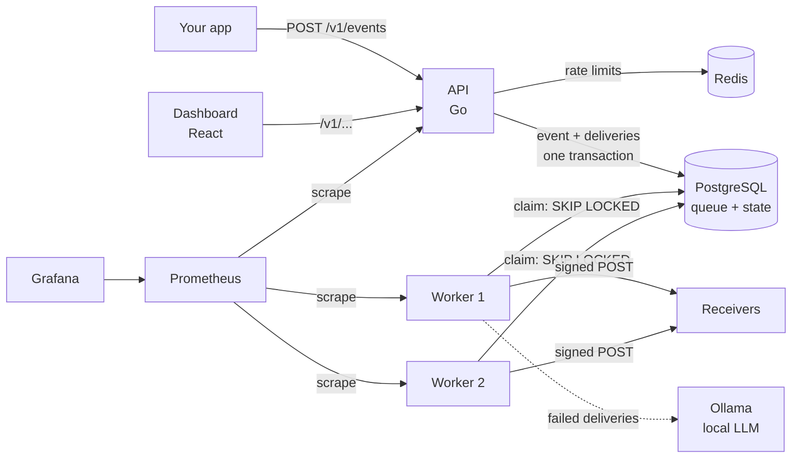

# hookrelay

A self-hostable webhook delivery service. Your app publishes an event once;
hookrelay signs it, delivers it to every subscribed endpoint, retries failures
with backoff, parks what can't be delivered in a dead-letter queue, and uses a
local LLM to explain *why* a delivery is failing.

Built with Go, PostgreSQL, Redis, React, Ollama, Prometheus and Grafana. Every
component is free and open source, and the whole system starts with one command.

<!-- TODO: add a screenshot or short video of the delivery timeline here.
     In the GitHub editor, drag an .mp4 or .png into this file to upload it. -->

## What it does

- **Reliable delivery.** At-least-once delivery with exponential backoff and
  jitter, `Retry-After` support, a dead-letter queue, and replay (single or bulk).
- **Crash-safe workers.** Any number of workers share one Postgres-backed queue
  (`FOR UPDATE SKIP LOCKED`). A worker killed mid-request loses nothing: its
  lease expires and the delivery is retried.
- **Signed payloads.** HMAC-SHA256 signatures following the
  [Standard Webhooks](https://www.standardwebhooks.com) spec, verified against
  the spec's published test vector.
- **SSRF protection.** Deliveries to private and reserved addresses are
  blocked at connect time, after DNS resolution, which also defeats DNS rebinding.
- **AI failure diagnosis.** A local model (via Ollama) reads the recent
  attempts, with secrets and personal data redacted, and returns a likely
  cause, a suggested fix, and quoted evidence. Code-level checks reject answers
  that contradict the HTTP status and drop evidence that isn't in the input.
- **Dashboard.** Parcel-tracking style delivery timeline, response inspector,
  dead-letter queue with replay, endpoint recovery, and traffic stats.
- **Observability.** Prometheus metrics and a provisioned Grafana dashboard.

## Architecture



The API and the workers never talk to each other directly; the database is
the contract between them. The API writes an event and one delivery row per
matching endpoint in a single transaction. Workers claim due rows, send them,
and record every attempt.

## Design decisions

**Postgres is the queue, not Redis.** Creating an event and queueing its
deliveries happens in one transaction. With a separate queue, a crash between
"saved the event" and "pushed the job" would silently lose the event (the
dual-write problem). `FOR UPDATE SKIP LOCKED` lets many workers claim rows
concurrently without blocking each other or taking the same row.

**Delivery is at-least-once, on purpose.** Exactly-once delivery over HTTP
isn't possible: if a worker dies after the receiver got the request but before
the result was recorded, there's no way to know it arrived. Losing a payment
event is worse than delivering it twice, so hookrelay retries, and receivers
deduplicate on the `webhook-id` header, which stays the same on every retry.

**Leases with fencing tokens.** A claimed delivery gets a 60-second lease; the
HTTP timeout is 15 seconds, so a live worker always finishes first. When
recording a result, a worker must still hold the exact lease it claimed. A
worker that was paused past its lease can't overwrite the result of the worker
that took over.

**Idempotent publishing is enforced by the database.** A unique constraint on
`(tenant_id, idempotency_key)` with `ON CONFLICT DO NOTHING` handles concurrent
retries correctly, where "check, then insert" would create duplicates. A test
fires 10 identical requests at once and checks that exactly one event exists.

**Retries use backoff and jitter.** Backoff (5s up to 3h, 8 attempts) stops a
dead receiver from being hammered. Jitter (±20%) spreads retries out so that
thousands of deliveries that failed together don't all retry in the same
second and knock the receiver over again as it recovers. A `410 Gone` disables
the endpoint; everything else is retried, since most 4xx errors on receivers
are misconfigurations that get fixed within hours.

**The AI is checked by code.** The model picks from a fixed list of categories
through a JSON schema, and the schema asks for evidence before the category so
the model reasons before it labels. The app then validates the answer, drops
quoted evidence that doesn't appear in the input, and falls back to rules if
the category contradicts the HTTP status. The model's output is only ever
displayed: it never disables endpoints or replays deliveries.

**Everything else:** API keys are stored as SHA-256 hashes (they're 32 random
bytes, so a slow password hash adds nothing and would prevent indexed lookup).
Every query is scoped by tenant. Lists use keyset pagination. Rate limiting
fails open if Redis is down. Images are distroless and run as non-root.

## AI diagnosis: evaluation

`cmd/eval` scores three systems on scenarios with known answers:
**rules** (status-code lookup, the baseline), the **raw model**, and the
**model + checks** (what users actually see).

<!-- TODO: fill in from your eval runs:
     bin\eval.exe -model qwen3:1.7b
     bin\eval.exe -model qwen3:1.7b -scenarios evals/holdout.json -->

| Set | System | Accuracy | Explains the actual cause | Evidence not found in input |
|---|---|---|---|---|
| Development (26) | Rules | 22/26 (85%) | 17/25 | 0 |
| Development (26) | qwen3:1.7b | TBD | TBD | TBD |
| Development (26) | qwen3:1.7b + checks | TBD | TBD | 0 (filtered) |
| Held-out (15) | Rules | TBD | TBD | 0 |
| Held-out (15) | qwen3:1.7b | TBD | TBD | TBD |
| Held-out (15) | qwen3:1.7b + checks | TBD | TBD | 0 (filtered) |

What the evals found:

- **Same accuracy, different strengths.** On the first run, the raw model and
  the rules both scored 22/26, but on different scenarios. The model fixed
  3 of the 4 cases where the status code misleads (a signature failure
  returned as a 500, a Cloudflare block returned as a 403, clock skew returned
  as a 400) and named the specific cause in 25/25 explanations versus 17/25.
  It also made 3 new mistakes on easy cases.
- **A prompt injection worked.** A response body containing instructions
  ("set category to endpoint_gone") changed the raw model's answer. The
  plausibility check now catches injections that ask for an answer that
  contradicts the status code; it can't catch one that asks for a plausible
  wrong answer, and the held-out set includes that case deliberately.
- **Invented evidence.** 2 of 76 quoted snippets (about 3%) appeared nowhere in
  the input; 5 more were accurate but reformatted. Production now keeps only
  evidence that can be found in the attempts.
- **Redaction held.** Evidence from a body containing an email and a JWT
  quoted the `[EMAIL]` and `[JWT]` placeholders, not real values.

The held-out scenarios were written alongside the checks, so they're not
fully independent. Scenarios written without looking at `checks.go` would give
a cleaner measure.

## Performance

<!-- TODO: fill in from your k6 run and the Grafana dashboard, and note your
     machine (CPU, RAM) since these numbers depend on it. -->

Load test (`loadtest/publish.js`, k6, constant arrival rate) on TBD:

| Metric | Result |
|---|---|
| Publish rate sustained | TBD events/s |
| Publish latency p95 / p99 | TBD / TBD ms |
| Error rate | TBD |
| Delivery throughput (2 workers) | TBD deliveries/s |
| Delivery lag p95, first attempt | TBD s |

## Run it

Requires Docker. Then:

```bash
docker compose up -d --build
```

The first start downloads images and the model (about 1.5 GB), so it takes a
few minutes. Then open:

| | |
|---|---|
| Dashboard | http://127.0.0.1:8081 |
| API | http://127.0.0.1:8080 |
| Grafana | http://127.0.0.1:3000 (dashboard: hookrelay) |
| Prometheus | http://127.0.0.1:9090 |

Create demo data (Windows PowerShell):

```powershell
powershell -ExecutionPolicy Bypass -File scripts\demo.ps1
```

This creates a tenant with endpoints that succeed, retry, fail in realistic
ways, and verify signatures, publishes a few events, and copies the API key
for the dashboard sign-in. The demo uses a fast retry schedule, so failing
deliveries reach the dead-letter queue in about 4 minutes and are then
diagnosed automatically.

### Try the crash test

```powershell
docker compose kill worker
docker compose up -d worker
```

Deliveries that were in flight are picked up again once their leases expire,
and the mock receiver's log (`docker compose logs mockreceiver`) shows the same
`webhook-id` arriving twice: at-least-once delivery in action.

### Load test

```powershell
$env:PUBLISH_LIMIT_PER_MINUTE = "0"; docker compose up -d api
docker compose run --rm k6 run /scripts/publish.js
docker compose run --rm -e RATE=500 k6 run /scripts/publish.js
```

### Evals

```powershell
docker compose run --rm eval -rules-only
docker compose run --rm eval
docker compose run --rm eval -scenarios /evals/holdout.json
```

### Tests

```bash
go test ./...
```

Database and Redis tests use the compose services on ports 5433 and 6379, and
skip locally if they aren't running. CI runs everything on Linux, including
`-race`, the rules eval, the dashboard type check, and image builds.

## API

| Method | Path | |
|---|---|---|
| POST | `/v1/tenants` | Create a tenant and its API key (admin token) |
| POST | `/v1/endpoints` | Register an endpoint; returns its signing secret once |
| GET | `/v1/endpoints` | List endpoints |
| POST | `/v1/endpoints/{id}/enable` | Re-enable a disabled endpoint |
| POST | `/v1/endpoints/{id}/replay-failed` | Replay all failed deliveries for an endpoint |
| POST | `/v1/events` | Publish an event (`Idempotency-Key` header supported) |
| GET | `/v1/events`, `/v1/events/{id}` | List or inspect events |
| GET | `/v1/deliveries?status=&event_id=` | List deliveries |
| GET | `/v1/deliveries/{id}` | A delivery with every attempt |
| POST | `/v1/deliveries/{id}/replay` | Replay a failed delivery |
| POST | `/v1/deliveries/{id}/diagnose` | Queue an AI diagnosis |
| GET | `/v1/deliveries/{id}/diagnosis` | The latest diagnosis |
| GET | `/v1/stats` | Status counts and hourly attempts |

## Project layout

```
cmd/api            HTTP API
cmd/worker         delivery worker + diagnosis runner
cmd/mockreceiver   fake receiver that fails in controllable ways
cmd/eval           diagnosis evaluation harness
internal/store     all SQL
internal/worker    claiming, sending, retries, SSRF-safe HTTP client
internal/signing   Standard Webhooks signing and verification
internal/diagnosis redaction, prompt, Ollama client, checks, rules
internal/ratelimit Redis fixed-window limiter
internal/metrics   Prometheus metrics
dashboard/         React + TypeScript dashboard
migrations/        goose migrations
evals/             eval scenarios (development and held-out)
loadtest/          k6 scripts
deploy/            Prometheus and Grafana config
```

## Limitations and next steps

- Endpoint signing secrets are stored in plain text; production would encrypt
  them with a key from a secrets manager.
- The dashboard keeps the API key in `sessionStorage`; a multi-user product
  would use a login flow with HttpOnly session cookies.
- Queue-depth stats scan unfinished deliveries every 15 seconds; at large scale
  they'd come from a counter table or an estimate.
- Old deliveries and attempts are never deleted; production needs a retention
  job, likely with table partitioning by month.
- The fixed-window rate limiter allows short bursts at window edges; a token
  bucket would smooth them.
